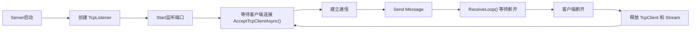

# TCP - 生命周期

#CSharp 

## 是什么

在 [[TCP - 简述]] 中已经简单讲解过 TCP 的创建完整流程。
但是，TCP在实际项目之中并不是简单的：

> 创建连接 → 发送数据 → 关闭

就最简单的一句话来描述：

> 服务端数据访问不止一次，而是会反复通过执行这个流程从而完整的提供 S端 数据服务。

**一个完整的 TCP 服务端通常需要处理：**
- 服务启动
- ┌等待客户端连接
-  | 保持通讯
-  | 接收和发送数据
-  | 检测断开
- └释放资源
- 等待新的连接（重复以上内容）

而这个单独实现的逻辑，就是 TCP 的生命周期。

---
## 服务端(S) -生命周期

**基本流程**：


**基本结构**：
```cs
Listener = new TcpListener(IPAddress.Loopback, port);  
Listener.Start();
while(true)
{
	Client = await Listener.AcceptTcpClientAsync();  
	Stream = Client.GetStream();  
	Send(Message);
	
	await ReceiveLoop();  // 检测是否还在连接状态
	Stream.Close();  
	Client.Close();
}
```

#### TCP 服务端两个核心流程

在 TCP 服务端通常存在两个阶段，一个是 Accept 和 Receive。

> 一个负责等待新的客户端建立连接，一个负责等待当前客户端的数据状态。

①`await Listener.AcceptTcpClientAsync()` 通过异步等待客户端连接成功。
这里并不是不断轮询连接状态，也不是一定创建新的线程。
而是通过异步IO机制等待连接事件。（见 [[异步 - 基础]]）

②`await ReceiveLoop();` 通过持续等待当前客户端的数据传输以及连接状态变化。
直到：收到数据、客户端正常关闭、发生异常，然后才继续执行后续资源释放代码。


---
## 关于 ReceiveLoop

从上面所知，ReceiveLoop 是负责维持当前客户端通信状态的异步方法。

其基本结构如下：
```cs
private async Task ReceiveLoop()
{ 
	byte[] buffer = new byte[1024];
	while(true) 
	{
		int length = await Stream.ReadAsync(buffer);
		if(length == 0) { break; } 
		HandleMessage(); 
	} 
}
```

其中的 `await Stream.ReadAsync(buffer)` 与`await Listener.AcceptTcpClientAsync()` 类似。

两者都是：

> 等待某个网络事件发生后恢复执行。

二者区别在于：一个等待新的客户端连接，一个等待当前客户端发送数据。

---
## TCP 信息传递机制

TCP本身并不存在一个实时同步的连接状态，也就是说： 

> Server并不会一直询问Client：“你还在线吗？” 

也就是说，TCP连接状态来自于通信过程中的事件反馈。


当Server执行`int length = await Stream.ReadAsync(buffer);`后，
返回值大于0，表示：

**收到了客户端发送的数据**。

❗
此时返回值代表的是**数据长度**，而不是状态码。

> **例如**：
> 客户端发送：*“Hello”*，那么：*length = 5;*
> 表示读取到了5个有效字节。


==那么为什么客户端关闭后返回的长度为 0 呢？==

> 因为TCP关闭连接并不是直接消失。

客户端关闭时，会通过TCP协议发送关闭通知：

```
Client
Close()
↓

发送 FIN
↓

Server
收到关闭事件
↓

ReadAsync()
↓

返回0
```

因此*length = 0*，表示：TCP已经通知当前连接正常结束。

而不是：收到了一个状态码0。

==详细知识见相关知识中的 **深入2**==

#### ⚠漏洞

但是TCP只能知道：*连接是否正常结束*。

它无法知道：*对方程序是否卡死*。

例如：
```
Client程序冻结
↓
TCP连接仍存在
↓
Server无法感知
```

因此实际项目中会在TCP之上增加应用层检测，即：心跳检测。（此处不展开讲解）


---
## 我在哪个项目里用过

#HierarchyTool 

---
## 容易踩坑

##### 1. 将 ReceiveLoop理解为心跳检测

错误的理解： ReadAsync检测客户端是否存活。

实际上，ReadAsync只能感知：
- 收到数据；
- 正常关闭；
- 异常。

心跳需要额外设计 Ping/Pong 消息。

##### 2. 单次 Accept 导致无法重新连接

**错误**：只实现执行一次`Client = await Listener.AcceptTcpClientAsync();`

问题在于，只执行一次，客户端关闭后无法重新等待连接，就如同开头写的生命周期。

需要不断循环该逻辑实现持续提供服务。

---
## 相关知识

- [[TCP - 简述]]
- [[TCP - 深入2 状态控制机制]]
- [[TCP - 深入3 包体结构]]
- [[TCP - 深入4 心跳机制]]