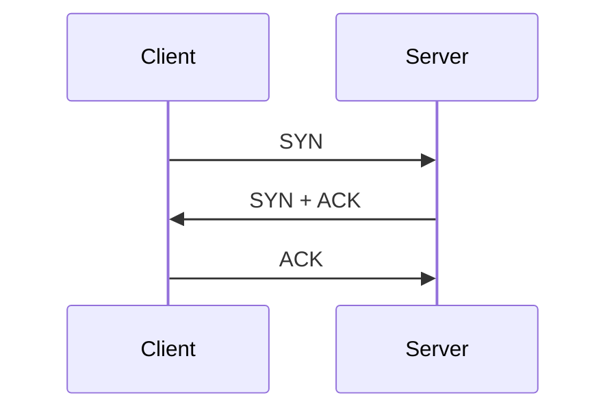
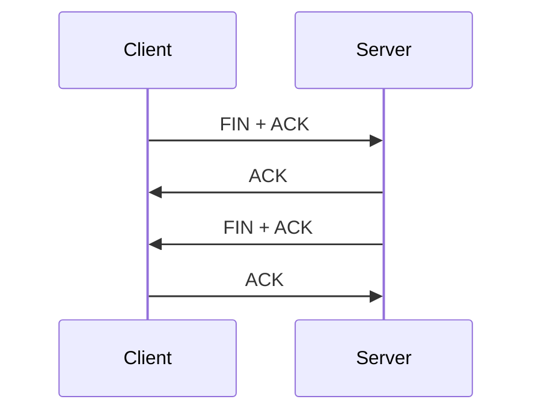
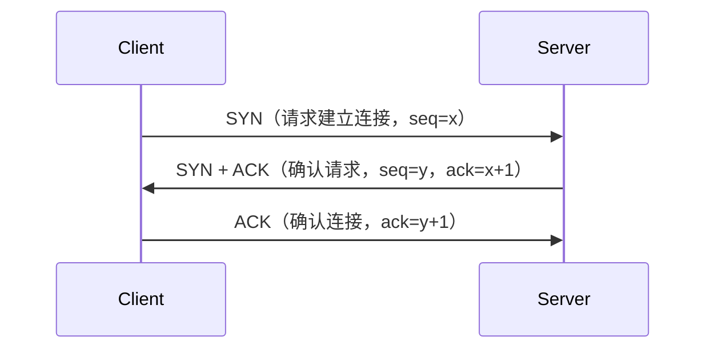
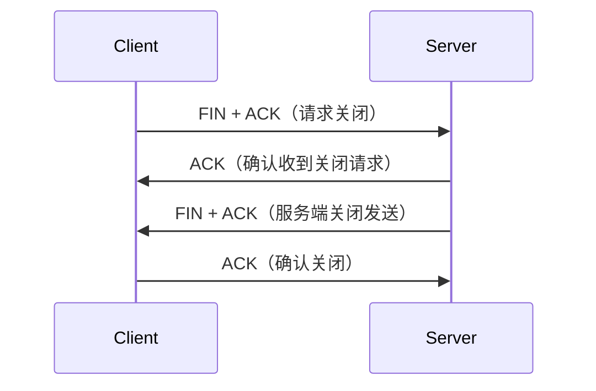
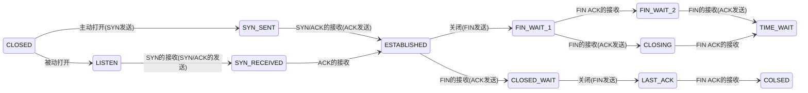

# 状态控制机制

#CSharp

## 是什么

TCP 是一种面向连接的可靠传输协议。

为了维护连接状态，TCP Header中设计了一组控制标志（Flags），用来表示当前数据包的作用。

TCP Header 中包含一组控制标志（Flags），用于表示当前 TCP 报文的控制意图。TCP 状态机根据这些 Flags 以及当前连接状态进行状态转换，从而维护 TCP 连接生命周期。

通过这些 Flags，TCP 可以完成：
- 建立连接
- 数据确认
- 数据推送
- 正常关闭
- 异常终止

---
## 为什么需要它

正如上面所写的，TCP 协议的核心价值在于它能不能构建一个可靠的传输层服务。通过这个机制，就能有效的保证数据的可靠传输、流量控制和拥塞控制。

---
## 核心控制标志（TCP Flags）

| Flag | Header         | 作用           |
| ---- | -------------- | ------------ |
| SYN  | Synchronize    | 建立连接，同步初始化序列 |
| ACK  | Acknowledgment | 确认已收到的数据     |
| FIN  | Finish         | 主动关闭连接       |
| RST  | Reset          | 强制终止连接       |
| PSH  | Push           | 立即交付应用层      |
| URG  | Urgent         | 紧急数据标记       |

### 1. SYN

SYN（Synchronize）用于请求建立 TCP 连接。

客户端发送：SYN = 1

表示：希望与目标建立连接，并同步双方初始化序列

> [!NOTE] 知识点
> TCP Header 中包含一组控制位（Control Bits），也称为 Flags（标志位），每一个 bit 表示一种控制状态。

**流程**（三次握手）：

*（注意：通常由主动连接的一方（例如客户端）发送 SYN，请求建立连接；服务端监听端口后响应 SYN+ACK。）*

### 2. ACK

ACK（Acknowledgment）用于确认数据已经收到。

例如：
```text
发送：
seq = 100
data = 50 bytes

回复：
ACK = 150
```

表示：已经收到序号 100~149 的数据，下次希望接收 150 开始的数据。

### 3. PSH

PSH（Push）表示：当前数据希望立即交付给应用层，不等待缓冲。

Wireshark 中可能看到：PSH + ACK
这是因为 TCP 数据传输时通常同时需要确认之前的数据，并提示接收端尽快将当前数据交给应用层。

### 4. FIN

FIN（Finish）表示当前方向已经没有数据发送，希望关闭连接。

**流程**（四次挥手）：


在 Unity TCP Server 中（HierarchyTool）：

> 客户端关闭 Socket 后，发送 FIN 码，Unity Receive接收到 Length = 0，从而判断客户端断开。对应了 ReceiveLoop 等于 0 后退出的原理（[[TCP - 深入1 生命周期]]）。

### 5. RST（异常关闭）

RST（Reset）用于强制终止 TCP 连接。

出现的常见情况：
- 连接不存在
- 目标端口没有服务
- 程序异常退出

> [!NOTE] 二者区别
> **FIN**： 正常关闭（双方完成关闭流程）
> **RST**：异常关闭（立即终止）

### 6. URG

URG（Urgent）表示紧急数据，用于标记需要优先处理的数据。

现代网络通信中较少使用。

---
### 三次握手和四次挥手（状态机）

TCP 是面向连接的协议，在正式传输数据前需要通过三次握手建立连接；通信结束时，需要通过四次挥手关闭连接。

#### 三次握手（建立连接）

三次握手的目的：
- 确认双方的发送和接收能力正常
- 同步双方初始化序列号（Sequence Number）
- 建立可靠的 TCP 连接

**流程**：

1. **第一次握手**
	
	客户端发送：SYN。
	表示客户端希望建立 TCP 连接，并发送自己的初始化序列号。
	（*Client主动打开*：CLOSED → SYN_SENT）
	
2. **第二次握手**
	
	服务端收到 SYN 后：发送 SYN + ACK。
	表示收到客户端请求，同意建立连接。
	（*Server被动打开*：CLOSE → LISTEN → SYN_RECEIVED）
	
3. **第三次握手**
	
	客户端收到 SYN + ACK 后：发送 ACK。
	表示收到服务器确认，连接建立完成。
	（*双方建立通信*：SYN_SENT / SYN_RECEIVED → ESTABLISHED）

#### 四次挥手

TCP 因为是双向通信（全双工通信），所以需要使用四次挥手关闭连接。
（需要分别关闭两个方向的数据传输才能结束通信）

**流程：**

1. **第一次挥手**
	
	主动关闭发送：FIN。
	表示我已经没有数据需要发送，希望关闭发送方向。
	（*Client主动关闭*：ESTABLISHED → FIN_WAIT_1）
	
2. **第二次挥手**
	
	被动关闭方收到 FIN 后：发送ACK。
	表示已收到关闭请求，此时对方不能再发送数据，本方仍可以发送剩余数据。
	（*Server被动关闭*：ESTABLISHED → CLOSE_WAIT）
	
1. **第三次挥手**
	
	被动关闭方发送完数据后：发送 FIN + ACK。
	表示自己也准备关闭连接。
	（*Server被动关闭*：CLOSE_WAIT → LAST_ACK）
	（*Client主动关闭*：FIN_WAIT_1 → FIN_WAIT_2 / CLOSING）
	
1. **第四次挥手**
	
	主动关闭方收到 FIN 后：发送 ACK。
	表示收到确认关闭。
	（*Client主动关闭*：FIN_WAIT_2 / CLOSING → TIME_WAIT）
	等待一段时间后，连接完全关闭。
	（*Server被动关闭*：LAST_ACK → CLOSED）

示意图：


---
## Wireshark 实践

- Wireshark 抓包信息
![[wiresharkTCP-1.png]]

- 专家分析
![[wiresharkTCP-Analysis.png]]

通过时间顺序，以及“分析 - 专家信息”中查看，可以了解到：

**建立连接**的时候确实使用到 ==SYN + ACK==。
**关闭连接**时双端都使用到了 ==FIN + ACK==。


---
## 我在哪个项目里用过

#HierarchyTool 

---
## 相关知识

- [[TCP - 深入1 生命周期]]
- [[TCP - 深入3 包体结构]]
- [[TCP - 深入4 心跳机制]]
