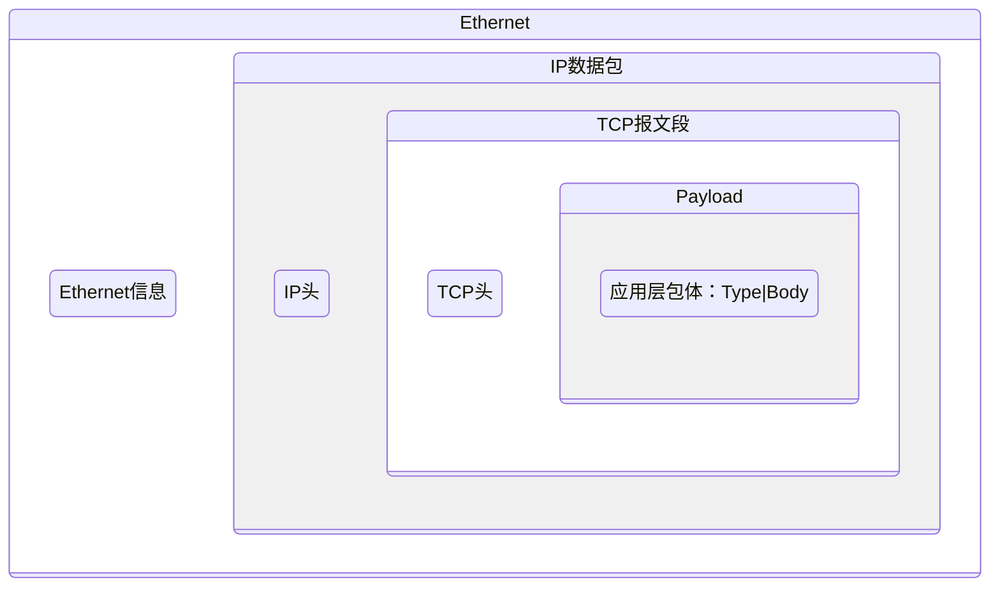

# TCP 数据封装结构

#CSharp 

**==本知识卡只讨论学习 TCP头 以及 包体结构 内容。==**

## 是什么

网络通信过程中，应用层数据会经过多个协议层封装。 
一次 TCP 数据传输的大致封装结构如下：



因为从网络分层和实际封装角度来说，数据在传输过程中是**逐层封装**的：
```txt
应用层数据
      ↓
传输层（TCP Header + 数据）
      ↓
网络层（IP Header + TCP报文）
      ↓
链路层（帧头 + IP数据）
```

也就是说：
- TCP Header **不是独立存在的**
- TCP报文整体会作为 IP 层的 Payload
- IP层再把整个 TCP 报文封装进去

其中： 
- **IP 头** 
	1. 网络层信息 
	2. 负责数据包在网络中的寻址与转发 
- **TCP 头**
	1. 传输层控制信息 
	2. 负责连接管理、可靠传输、数据确认等 
- **Application Data（Payload）** 
	1. 应用层真正发送的数据 
	2. 例如 XML、JSON、游戏数据等


---
## TCP Header 

TCP Header 是 TCP 协议自动添加的控制信息，应用层通常不直接操作。

主要用于： 
- 建立和关闭连接 
- 保证数据可靠传输 
- 控制数据顺序 
- 确认数据接收状态

```text
TCP Header（最小20字节）

  0                   15                  31
  +-------------------+-------------------+
  |    源端口号(16)    |   目标端口号(16）   |
  +-------------------+-------------------+
  |               序列号(32)               |
  +---------------------------------------+
  |               确认号(32)               |
  +----+------+----------------+----------+
  |HLEN| 保留位|     标志位      |  窗口大小 |
  +----+------+----------------+----------+
  |        校验和(16)          |  紧急指针  |
  +--------------------------+------------+
  |             Options (可选项)           |
  +---------------------------------------+
  |               Data                    |
  +---------------------------------------+
```

| 常见字段 | 作用 | 常见字段 | 作用 |
| ----------- | ------- | ---- | ------- |
| 源端口 | 标识发送方应用 | 目标端口 | 标识接收方应用 |
| 序列号 | 保证数据顺序，用于数据重组 | 确认号 | 确认已接收数据，并表示期望收到的下一个数据编号 |
| 报文头长度（HLEN） | 表示TCP Header长度，用于确定数据起始位置 | 保留位 | 预留字段，用于协议扩展，通常为0 |
| 标志位 | 控制TCP状态，例如建立连接、确认数据、关闭连接 | 窗口大小 | 表示接收方当前可接收的数据量，用于流量控制 |
| 校验和 | 检查数据传输过程中是否发生错误 | 紧急指针 | 配合URG标志使用，表示紧急数据位置 |
| 选项 | 提供TCP扩展功能，例如时间戳、窗口扩大等 | 数据 | 实际传输的应用层数据（Payload） |

其中标志位（Flags，各一位）在 TCP 状态控制中非常重要，分别有以下标志：
- URG
- ACK
- PSH
- RST
- SYN
- FIN
（具体的含义，可查看：[[TCP - 深入2 状态控制机制]]）

**例如**：SYN → SYN + ACK → ACK，表示 TCP 三次握手建立连接。

---
## TCP Payload 

TCP Header 后面的部分称为 Payload（负载）。

**TCP只负责**： 可靠地传输连续的字节。 

但它并不知道 Payload 中的数据具体是什么。

TCP最终传输的是字节流（二进制数据）：01001000 01100101 01101100

因此无法判断它表示：
```
Hello
```

还是其他数据。
因此 Payload 的具体格式需要由应用层自行定义。

这就引申出了==应用层包体设计==。

---
## 应用层包体设计

TCP属于：

> **字节流协议**

它不会保留发送方的数据边界。

例如：
```csharp
发送：
Send("Hello");
Send("World");
````

接收端可能收到：
```
HelloWorld
```
也可能收到：
```
Hel
loWorld
```

因此应用层需要设计自己的消息结构，用于：
- 判断消息类型
- 区分不同数据
- 确定消息边界

**以下有三种常见的包体设计结构**：
#### 1. ==分隔符方式==

格式：
```
Type|Body
```

例如：
```
1|<Hierarchy>...</Hierarchy>
```

**优点**：
- 简单直观
- 方便调试

**缺点**：
- 分隔符可能与数据冲突
- 不适合复杂协议

#### 2. ==长度字段方式==

格式：
```
Type|Length|Body
```

例如：
```
1|1024|<Hierarchy>...</Hierarchy>
```

通过 Length 确定 Body 长度，解决 TCP 拆包问题。

#### 3. ==固定 Header 方式==

格式：
```
+------+--------+------+  
| Type | Length | Body |  
+------+--------+------+
```
常用于游戏网络协议。

**特点**：
- 解析效率高
- 适合高频通信

---
## 我在哪个项目里用过

#HierarchyTool 

---
## 容易踩坑

- 不要认为一次 Send 对应一次 Receive。 
- TCP 不提供消息边界，需要应用层自行设计协议。
- Payload格式需要提前约定，否则双方无法解析数据（[[XML StringWriter编码差异踩坑]]）。

---
## 相关知识

- [[TCP - 简述]]
- [[TCP - 深入1 生命周期]]
- [[TCP - 深入2 状态控制机制]]
- [[TCP - 深入4 心跳机制]]
