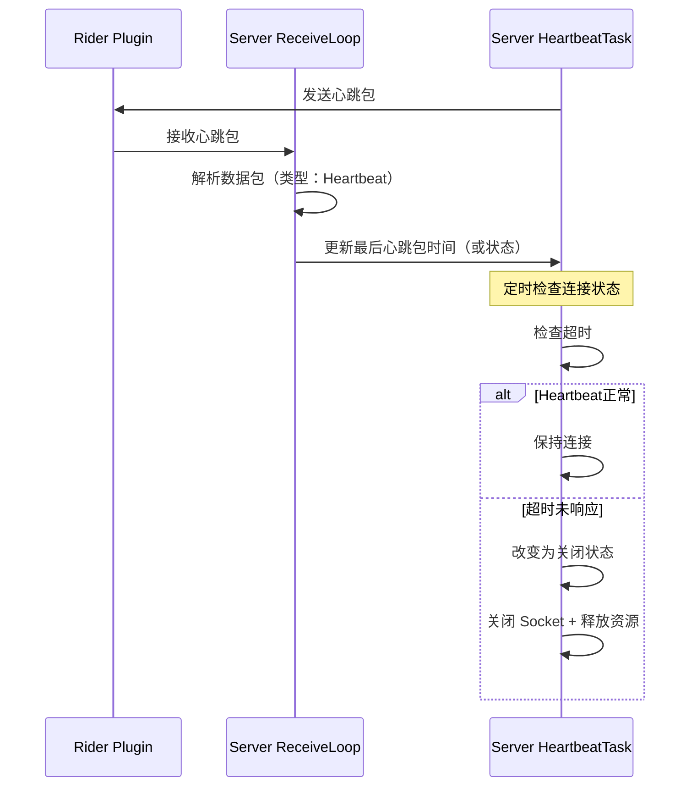

# 心跳检测机制

#CSharp 

## 是什么

> 心跳机制（Heartbeat）是一种通过周期性发送检测信息，用于确认通信双方连接是否仍然有效的机制。

在长连接通信中，即使 TCP 连接仍然存在，也不代表双方都工作正常。

因此保险情况下，还需要通过应用层消息主动检测连接状态。


---
## 为什么需要

TCP 本身提供：
- 可靠传输
- 数据有序
- 连接维护

但是TCP不知道：
- 对方应用是否崩溃
- 网络是否不可达
- 对方是否停止响应

例如：


从而产生TCP处于连接的假象，实际上可能Client已经处于不可用状态。

这种情况称为：**半连接 / 假连接状态**

---
## 检测流程

以 HierarchyTool 项目中的流程为例：



这里：
- HeartbeatTask负责发送
- ReceiveLoop负责接收
- ReceiveLoop通知HeartbeatTask更新状态

#### ReceiveLoop作用
- 接收数据
- 解析Packet
- 判断消息类型（普通、FIN关闭、心跳等）
- 分发处理

因此，心跳机制不是独立于通信流程之外的功能，而是协议层的一种消息类型。


> *该流程是以Server主动发送Heartbeat为逻辑进行绘制。主要用于判断客户端是否在线。*
> *而客户端探测服务端逻辑则是相反，由客户端发起心跳问询。*

实现成果图片：
![[HeartbeatTest.jpg]]

---
## 心跳消息设计

心跳本质上也是一种应用层消息，同样借助TCP发送消息来实现。

因此可以复用消息协议（简化）：
```cs
enum MessageType
{
	XML = 0,
	Heartbeat = 1,
	Close
}
```

数据流程：


与普通数据不同，Heartbeat通常不携带业务数据。


### 关于心跳间隔设计

心跳间隔需要根据实际需求调整。

过短：
- 增加网络压力
- 消耗额外资源

过长：
- 断线发现不及时

因此在设计时需要在 ==实时性== 和 ==性能== 之间进行平衡。


---
## 我在哪个项目里用过

#HierarchyTool 

在 Unity Editor 与 Rider Plugin 通信中，由于 TCP 长连接需要持续保持：
- Unity端发送Hierarchy数据
- Rider端保持连接状态

因此加入Heartbeat消息：
```
TcpServer
↓

Heartbeat检测
↓

判断Client是否仍在线
```

用于避免：
- Rider异常关闭后连接残留
- TCP假连接状态

---
## 容易踩坑

#### ❗ 心跳不是TCP自带功能

TCP 本身只负责：
- 可靠传输
- 数据有序到达
- 连接维护

并不会主动提供：
- 应用状态检测
- 客户端存活判断
- 业务层连接管理

因此长连接应用通常需要自行设计应用层 Heartbeat。


同时通过增加Heartbeat消息：
- 定时发送Heartbeat
- 接收响应
- 记录最后通信时间
- 超时关闭连接
还能实现应用层更复杂更适合需求的连接检测。

---
## 相关知识

- [[TCP - 简述]]
- [[TCP - 深入1 生命周期]]
- [[TCP - 深入2 状态控制机制]]
- [[TCP - 深入3 包体结构]]