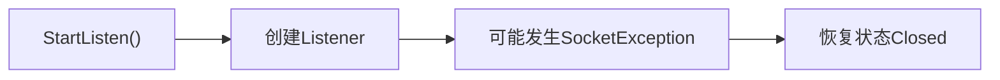

# 异常

#CSharp 

## 是什么

> 异常（Exception）是程序运行过程中发生的非正常情况，
> 用于表示无法按照正常流程继续执行的问题。

例如：
- 文件不存在
- 网络连接失败
- 数据格式错误
- 参数非法 等。

---
## 为什么需要异常处理

程序运行过程中无法避免所有错误。

如果没有异常处理，当错误发生时程序会直接终止。

而通过异常机制，可以实现：


从而保证程序稳定运行。

---
## 异常层级

C# 中的异常都继承自：`System.Exception`。

例如：
```text
Exception
├── IOException
├── InvalidOperationException
├── ArgumentException
├── SocketException
└── ...
```

这些都是属于最基本常见的异常。但是还有很多情况下的异常，是非`System.Exception`中的。

#### 常见非`System.Exception`异常

##### 1. SocketException

该异常属于网络通信异常，常发生于：
- Port被占用
- 网络不可达等
```cs
try
{
	listener.Start();
}
catch(SocketException e) { }
```

##### 2. IOException

输入输出异常，常发生于：
- 文件读取失败
- Stream关闭

##### 3. InvalidOperationException

操作状态不合法。

例如：
`listener.AcceptTcpClientAsync();`在Listener还没Start启动前就使用了。

---
## 异常处理流程

```cs
try
{
	// 执行可能失败的代码
}
catch(Exception e)
{
	// 处理异常
}
finally
{
	// 释放资源
}
```

---
## 我在哪个项目里用过

#HierarchyTool 

TcpServer启动：


重点：异常处理不仅仅是捕获错误，还需要保证**异常发生后程序状态仍然正确**。

---
## 相关知识

- [[TCP启动失败导致的状态不一致]]