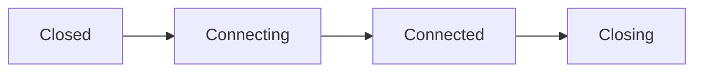
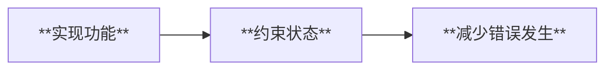

# 从数据优先思想重新审视编码设计安全

#ProgrammingPattern 

## 起因

在开发 Hierarchy Tool Rider Plugin 时，第一次使用 Kotlin 编写 TCP Client。

由于 Kotlin 和 C# 在设计理念上存在一定区别，在迁移实现过程中发现：

以前部分 C# 代码虽然可以正常运行，但是对于：

- 数据修改
- 对象状态
- 多线程访问
- 资源释放

等方面缺少约束。

因此重新思考了一下之前 C# 代码的安全性问题。

---

## Kotlin 与 C# 的设计差异

Kotlin 更偏向：

> 以数据为核心，通过语言特性限制错误发生。

例如：

- `val` 默认不可修改
- `data class` 强调数据结构
- 空安全机制
- 协程与 Mutex 提供并发控制


而 C#：

> 提供更多自由度，但需要开发者主动维护状态。

因此很多问题不会在语言层面阻止，而是需要自己设计。

---
# 1. 数据对象应该保持稳定

**Kotlin 中：**
```kotlin
data class TcpMessage(
    val typeCode:Int,
    val body:String
)
```

数据创建后默认不可修改。这样可以保证：

> 数据是什么，就一直是什么。（减少不必要修改所造成的数据污染）


**而 C# 中：**

```
public string body;
```

如果直接暴露字段，任何地方都可能修改数据。

因此应该通过：
- readonly
- private set
- 构造初始化

限制数据变化。

---
# 2. 共享数据需要考虑线程安全

在 Kotlin TCP Client 中发送消息：
```
sendMutex.withLock {

}
```

明确保证：

同一时间只有一个线程发送数据。

这让我重新思考之前 C# 中的写法。

最开始编写时默认认为：

> 当前不会出现多个线程同时访问。

但是实际项目中：
- Task
- 异步回调
- 多线程

都有可能造成竞争。

因此需要主动设计（线程锁）：
```
lock()
```

保证共享资源安全。

---
# 3. 对象状态应该明确

以前 C# 中经常通过：

```
if(socket != null)
```

判断对象状态。

**但是实际上**：socket存在 ≠ 连接正常。

对象可能处于：
- 未连接
- 正在连接
- 已连接
- 正在关闭

因此应该使用明确状态管理。例如：



避免隐藏状态。

---
# 4. 资源释放属于生命周期的一部分

以前处理异常时,容易关注：

“哪里报错？”

但是会习惯性地忽略：
- 对象有没有释放
- 状态有没有恢复
- Task有没有结束

例如 TCP 中，连接关闭后需要：
- 设置连接状态
- 关闭 Socket
- 清理引用

而不是只处理异常。

---
# 5. 减少可变数据带来的问题

Kotlin 中，`val`默认不可修改。

这种设计让我意识到：

很多问题来源于：

> 数据被随意修改。

这也正好符合 Kotlin 语言的设计精髓。

同理，因此我们在 C# 中也应该尽量：
- 减少 public 字段
- 使用属性控制访问
- 限制修改范围

---
## 实际应用

在 Hierarchy Tool 中，

通过 Kotlin 学习到的设计思想，重新优化 TCP 模块：
- 使用 Mutex 保证发送安全
- 使用状态变量管理连接生命周期
- 明确 Socket 生命周期
- 减少共享可变数据
- 分离数据层与通信层

---
## 总结

之前：

> 关注代码能不能正常运行。

现在：

> 关注代码是否容易进入错误状态 以及 其过程变化。

Kotlin 的学习不仅是语言迁移，更让我重新审视 C# 中的工程设计方式。

从：



---
## 一句话总结

Kotlin让我发现，好的代码不仅要能运行，更应该通过结构设计减少错误状态出现。