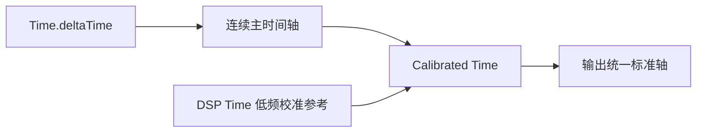

# 音频与连续时间轴的校准

#Runtime

## 问题来源

Unity 中如果需要一个长期与音频时间保持一致、同时又能用于连续运动的时间轴[^3]，会遇到两个时间源各自的问题：

**`Time.deltaTime`**[^1]
- 每帧更新，连续性高
- 适合运动与动画
- 长期累积后可能与音频时钟产生偏差（音频卡顿、错位等情况）

**`AudioSettings.dspTime`**[^2]
- 以音频 DSP 时钟为基准，长期时间参考稳定
- 但实际读取时存在阶梯式更新，当前PC环境下实测约每 `21ms` 更新一次
- 若直接用于连续运动，会产生明显闪抖

因此不能简单地只选择其中一个作为完整时间轴。

---
## 初测现象

> **直接使用 dspTime 的每帧时差**

当运动位置直接根据 `dspTime` 计算时，时间值本身取于音频时间，但由于约 21ms 才产生一次新值。用于运动会存在明显闪跳情况。

因此：**DSP Time 适合作为时间参考，不适合作为连续运动的直接推进源。**

> **直接累计 deltaTime**

`runTime += Time.deltaTime` 的运动表现稳定且连续。

但 deltaTime 所形成的是游戏侧时间轴，与音频 DSP 时钟并非同一个时钟，因此长时间运行后存在产生 drift(漂移) 的可能。

---
## 📀核心思路

使用两个时间源分别承担不同职责：

即：
- `deltaTime`：负责连续推进
- `dspTime`：负责检查主轴是否产生长期偏移
- 不直接将主轴跳转到 DSP 时间
- 而是通过短时间改变主轴推进倍率，使两者逐渐重新对齐

*注：该方案通过衡量工程量以及实现难度后才使用（简单固定 drift 无法解决实际问题、较难的预计算工程量不适用于个人开发）*

## ⏱校准方式

在运行过程中，主时间轴仍然通过 `Time.deltaTime` 逐帧累加。当检测到 DSP Time 产生新的时间步长时，计算当前主轴与 DSP 时间之间的偏差：$error = runTime - dspTime$

但误差存在两个方向，分别是：主轴领先 DSP时间、主轴落后于 DSP时间。

##### 1. 主轴超前时

当 `runTime > dspTime` 时，说明此时连续时间轴相对于 DSP 时间有所超前。
此时不直接将 `runTime` 回退到 DSP Time，而是在一个短时间窗口内降低主轴推进倍率，使 DSP 时间轴在主轴缓行时追上。

设 $step$ 为一次校准使用的时间窗口，$\Delta = runTime - dspTime$ 为主轴超前的时间差。

则主轴校准速率为：
$$
rate = \frac {step} {step + \Delta}
$$
此时 $rate < 1$ 。

因此在接下来的一段时间中，时间轴会以略低于原始 `deltaTime` 的速度推进，直到完成当前校准。

##### 2. 主轴落后时

此时 `runTime < dspTime` 时，说明当前连续时间轴落后于DSP时间。此时采用相反方式，在短时间窗口内提高主轴的推进倍率。

设主轴落后量为 $\Delta = dspTime - runTime$ ：
$$rate = \frac {step + \Delta} {step}$$
此时 $rate > 1$ 。

使主轴在原有时间窗口内额外追回对应的时间差。

> 这种方式不会直接改变 DSP Time，也不会瞬间修改当前主轴，而是通过调整一段时间内的时间增量完成渐进式校准。

#### 关于校准窗口

DSP Time 本身存在一定的更新粒度。在当前 PC 环境中测试，我们能得到：`dspStep ≈ 21ms`

如果每次出现极小偏差时都进行校准，会导致校准倍率频繁变化，反而使连续时间轴产生不必要的细小波动。

因此校准窗口使用 DSP 更新时间间隔作为基础：$step = dspStep * CorrectionRatio$ 。

只有当 $|error| >= step$ 时才启动下一轮校准。

实际测试中当 `CorrectionRatio = 1` 时校准触发频率较高。
调整为`CorrectionRatio = 2`后，时间轴依旧能够稳定维持在 DSP 时间附近，同时明显减少了频繁校准带来的额外开销。

因此当前使用 `2 × dspStep` 作为默认校准窗口。

> `CorrectionRatio` 并不是固定理论值，其作用更接近于控制校准的最小窗口与修正频率，应根据实际运行环境进行测试。

---
## Profiler测试

初始使用 `1 × dspStep` 作为校准窗口时，由于校准触发较为频繁，在 Profiler 中可以观察到周期性的额外开销峰值，GC Allocated 峰值一度达到约 `~1200 count`。

将校准窗口调整为：$2 * dspStep$ 后，过高峰值基本消失，GC Alloc 回落到正常情况下约 `15 count` 左右，同时 CPU 曲线也更加稳定。

![[CalibratedProfiler.jpg]]

因此在当前测试环境下：

> 增大校准窗口并没有产生可感知的时间同步问题，反而减少了不必要的频繁修正，使运行状态更加稳定。

需要注意的是，该结果来源于 Unity Editor 下的 Profiler 测试，主要用于不同参数之间的相对比较，并不能完全代表最终 Player Build 的实际性能。

---
## 容易踩坑

#### 1. DSP Time 未变化不代表时间停止

由于 DSP Time 存在阶梯式更新，因此当 `dspNow == lastDspTime`时：

通常只代表当前尚未进入下一个 DSP 更新周期，并不代表音频暂停或系统卡顿。因此不能在 DSP Time 未变化时直接取消正在进行的校准，否则校准可能只持续一帧。

#### 2. 不应该直接使用 DSP Time 驱动连续运动

DSP Time 本身作为音频参考时间没有问题，但其读取结果可能以较大的时间步长更新。
直接用于位置、旋转等连续运动时，会使视觉结果呈现明显阶梯变化。

#### 3. 校准应该支持双向修正

时间偏差并不一定只会发生在一个方向，需要同时处理：
- 主轴超前 → 降低推进倍率
- 主轴滞后 → 提高推进倍率
否则当主轴长期落后于 DSP Time 时无法自动恢复。

#### 4. Script Execution Order 会影响初始差值

实际测试中，修改脚本执行顺序后，主轴与 DSP Time 的初始固定差值也发生了明显变化。
因此两者的绝对差值中可能包含主线程执行时机与 DSP 采样时机造成的固定 Offset。
运行时校准更关注的是时间轴是否持续漂移，而不是强制要求两个时间值在任何时刻完全相等。

---
## 相关知识

[^1]: [Unity - 脚本API：Time.deltaTime](https://docs.unity.cn/ScriptReference/Time-deltaTime.html)

[^2]: [AudioSettings-dspTime - Unity 脚本 API](https://docs.unity.cn/cn/2022.3/ScriptReference/AudioSettings-dspTime.html)

[^3]: [Unity - Scripting API: Time](https://docs.unity.cn/ScriptReference/Time.html)
