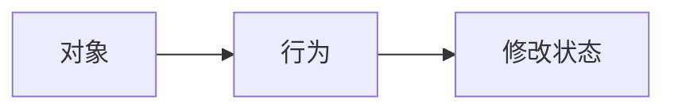
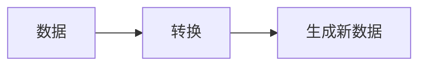
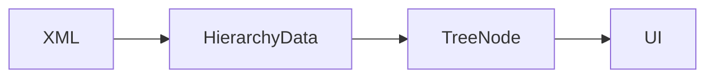

# Kotlin 基础语法

#Kotlin #快速学习

## 是什么

**Kotlin**

> 一种运行在 JVM 上的现代编程语言，与 Java 高度兼容。

相比 Java，Kotlin 主要优化：
- 减少模板代码
- 提供空安全机制
- 默认鼓励不可变数据
- 支持数据模型驱动开发

在 JetBrains 插件开发中，Kotlin 主要用于：
- 插件逻辑编写
- 数据结构定义
- UI组件调用

---
# 基础语法

## 1. 变量声明

Kotlin 使用：
```kotlin
val name = "Player"

var hp = 100
```

其中：

| 关键字 | 含义     |
| --- | ------ |
| val | 不可重新赋值 |
| var | 可重新赋值  |

**关于 val**，它类似 C# 中的`readonly`，表示变量引用不可改变。

但是对象内部仍然可以修改：`node.children.add(child)`

> [!NOTE] 为什么 Kotlin 默认使用 val？
> **传统语言**：默认变量可修改，需要额外声明不可修改。
> 
> **Kotlin**：默认不可修改，需要主动声明可修改。
> 
> **原因**：可变状态越多，程序越难维护。
> 
> 例如：
> ```kotlin
> var data = HierarchyData()
> ```
> 
> 任何地方都可能修改 data。而：
> ```kotlin
> val data = HierarchyData()
> ```
> 
> 可以保证引用不会变化。
> 
> 因此 Kotlin 更倾向：**数据流明确，而不是依靠大量对象状态变化。**


## 2. 类型声明

Kotlin 类型写在变量后：
```kotlin
val name: String = "Player"

val id: Int = 10
```

格式：
```
变量名: 类型
```

类似 C#：
```cs
string name = "Player";
int id = 10;
```


## 3. 函数

Kotlin 使用：
```
fun 函数名()
{}
```

例如：
```kotlin
fun parseData(xml:String):HierarchyData?
{}
```

其中：
- `fun` 表示函数
- `:` 后表示返回类型

未声明返回值，返回：
```kotlin
Unit
```

类似 C#
```cs
void
```

---
# Data Class

### 是什么

> 用于表示纯数据对象的特殊类。

例如：
```kotlin
data class HierarchyNode(
    var name:String,
    var children:MutableList<HierarchyNode>
)
```

它会自动生成：
- `toString()`
- `equals()`
- `hashCode()`
- `copy()`

### 为什么需要 Data Class

很多对象本身没有复杂行为。

例如：
```
HierarchyData

SceneName
ExportTime
Roots
```

它本质只是数据集合。

如果使用传统 Java，需要手动编写：
- 构造函数
- getter/setter
- equals
- hashCode

而 Kotlin，直接通过：
```kotlin
data class
```

描述数据结构。

---
# 空安全

### 为什么需要

Java 中：
```java
String name = null;
name.length();
```

可能产生`NullPointerException`。因此Kotlin 默认禁止该写法：

```kotlin
var name:String = null
```

如果允许为空须写为：
```kotlin
var name:String? = null
```

其中`?`表示：

> 这个变量可能为空。

### 安全调用

```kotlin
name?.length
```

表示如果 name 不为空，则调用 length。

类似 C#：`name?.Length`

---
# Elvis 运算符

```kotlin
val result = name ?: "Unknown"
```

表示如果 name 为空，则使用默认值。

类似：
```cs
name ?? "Unknown"
```

---
# Kotlin 常见语法糖

## 1. ifBlank

```kotlin
element.getAttribute("Script").ifBlank { null }
```

表示如果字符串为空，则返回 null。

类似：
```cs
string.IsNullOrWhiteSpace()
```

## 2. 范围运算

```kotlin
0..<length
```

表示：
```
0 ~ length-1
```

很便于`for`和数值判断。

---

# Kotlin 与传统面向对象的区别

传统 OOP（Object Oriented Programming）：


例如：
```
player.TakeDamage()
```


Kotlin 更常见：


例如：



因此 Kotlin 更偏向：

**数据模型 + 数据转换 + 业务逻辑**

而不是：

**大量对象之间互相修改状态。**

（简单来说就是Kotlin主要 面向数据过程）

---
# 我在哪个项目里用过

#HierarchyTool 

Unity：
```
【HierarchyNode.cs】
GameObject
    ↓
HierarchyNode
    ↓
XML
```

Rider：
```
XML
↓

HierarchyNode.kt
↓

TreeNode
↓

JTree
```

Kotlin 主要负责：
- XML数据解析
- 数据结构定义
- UI数据转换

---
# 总结

Kotlin 的核心思想：

> 用更简洁的语法描述数据，并通过不可变数据减少状态错误。

本次学习重点：

- `val / var`
- `fun`
- 类型声明
- `data class`
- 空安全
- 数据驱动思想