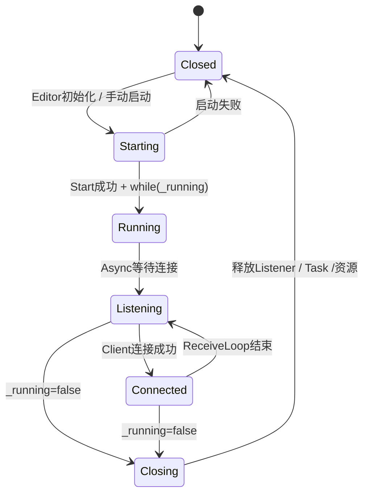

# Hierarchy Tool  
  
#Project #HierarchyTool  
  
## 为什么做  
  
希望在 Rider 中实时查看 Unity Hierarchy。  
  
**避免**：Unity  ↔  Rider  频繁切换查看信息。  
  
同时借此理解：  
- Unity Editor扩展 
- Scene / Hierarchy / Transform 
- Editor生命周期 
- TCP通信 
- 自定义数据协议 
- Rider插件开发
  
---  
## 当前架构  
  
HierarchyWindow  
│  
├─ IDEHierarchySetting
│  
├─ TcpServer
│  
├─ HierarchyExporter
└─ XmlExporter

**流程**：

Hierarchy变化
↓
HierarchyExporter
↓
HierarchyData
↓
XmlSerializer
↓
TcpServer
↓
Rider Plugin  
  
---  
## 已解决的问题  


- [x] TCP基础连接建立
- [x] EditorWindow配置界面
- [x] Hierarchy变化监听
- [x] RootObject获取
- [x] Parent/Child递归读取
- [x] Hierarchy数据结构化
- [x] XML序列化导出
- [x] TCP连接断开检测
- [x] TcpServer生命周期管理
- [x] Editor关闭/程序集重载资源释放
- [x] TCP基础消息协议设计
- [x] UTF-8 / UTF-16编码问题排查
- [x] TCP基础通信流程完善
- [ ] 

---  
## 当前问题  

**Rider Plugin**
- [ ] Rider侧树形显示  
- [ ] Kotlin插件编写

**TCP通信完善**
- [ ] TCP消息解析
- [ ] 心跳机制完善

**工具优化**
- [ ] 性能优化  
  
---
## 当前架构


#### TcpServer 生命周期



---
## 架构演进记录  
### V1  
  
HierarchyExporter  
├─ Hierarchy读取  
├─ TCP  
└─ 配置读取  

IDEHierarchySetting
└─ UI 与 基础配置
  
问题：
**职责混杂**。  

出现：
- 配置初始化顺序不明确
- static初始化时机不可控
- TcpServer依赖关系混乱

（引路：[[静态变量初始化生命周期问题]]）
  
---  
### V2（几乎完成）
  
拆分为三部分：

**IDEHierarchySetting**

负责：
- UI配置
- 参数管理

**HierarchyExporter**

负责：
- Hierarchy读取
- 数据构建

**TcpServer**

负责：
- TCP连接
- 数据发送
- 生命周期管理

三部分职责独立。

**解决**：
- 配置管理与通信逻辑耦合
- 数据构建与发送逻辑混合
- 初始化顺序不可控问题
  
---
## 后续 V3 规划

```
HierarchyExporter
↓

Data Layer
↓

Protocol Layer
↓

TCP Layer
↓

Rider Plugin
```

方向：
- 独立协议层
- 增加消息类型管理
- 增加心跳检测
- 支持更多数据类型

---
## 学到了什么  
#### Unity Editor
- Scene是Hierarchy数据来源
- Hierarchy本质是一棵Transform树
- Editor脚本需要考虑生命周期
- InitializeOnLoad 与 Editor事件监听机制
- EditorPrefs 配置持久化
- EditorWindow 工具开发流程


#### CSharp
- static 生命周期与初始化顺序
- Property属性访问控制
- XML序列化特性
- using三种用法
- async Task 生命周期与任务管理


#### 网络通信
- TCP连接建立与关闭流程（三次握手 / 四次挥手）
- TCP连接生命周期与状态转换
- TCP应用层协议设计
- TCP消息边界问题
- 自定义消息格式设计 Type|Body


#### Programming Pattern —— 程序模式
- 状态机控制思想
- 状态锁与线程锁区别
- 通过状态管理程序生命周期

---
## 日记与周记

- [[2026-06-24]]
- [[2026-06-25]]
- [[2026-06-26]]
- [[2026-07-06]]
- [[2026-07-07]]
- [[2026-07-09]]
- [[2026-07-10]]
- [[2026-07-11 周记]]
- [[2026-07-12]]
- [[2026-07-14]]
- [[2026-07-15]]
- [[2026-07-23]]
- [[2026-07-24]]
- [[2026-07-25]]
- [[2026-07-26]]
- [[2026-07-27 周记]]
- [[2026-07-27]]
- [[2026-07-28]]
- 